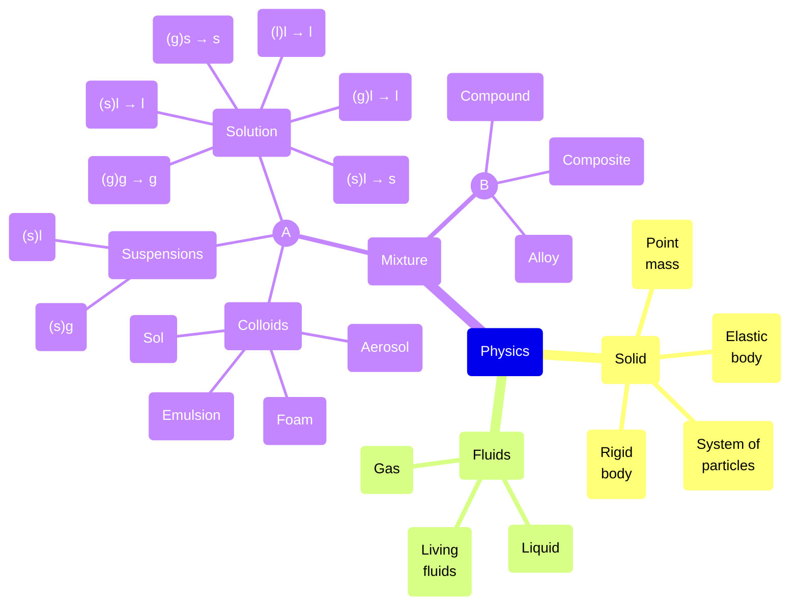

```mermaid
mindmap
  ("Physics")
    ("Solid")
      ("Point<br>mass")
      ("System of<br>particles")
      ("Rigid<br>body")
      ("Elastic<br>body")
    ("Fluids")
      ("Liquid")
      ("Gas")
      ("Living<br>fluids")
    ("Mixture")
      (("A"))
        ("Solution")
          ("(g)g → g")
          ("(g)l → l")
          ("(l)l → l")
          ("(s)l → l")
          ("(g)s → s")
          ("(s)l → s")
        ("Colloids")
          ("Sol")
          ("Emulsion")
          ("Foam")
          ("Aerosol")
        ("Suspensions")
          ("(s)l")
          ("(s)g")
      (("B"))
        ("Alloy")
        ("Composite")
        ("Compound")
```

    <figure>
        
        <figcaption>媒体院SLAM地图成功融合</figcaption>
    </figure>
    <figure>
        
        <figcaption>媒体院SLAM地图融合失败</figcaption>
    </figure>

