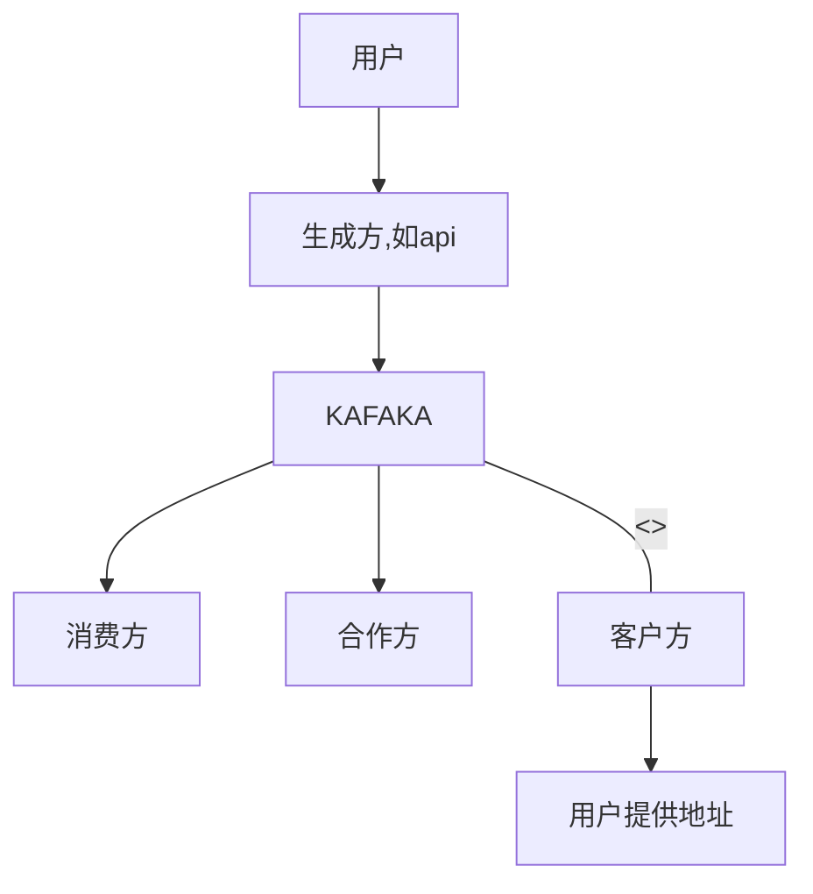

```mermaid

    graph TD

用户-->生成方,如api

生成方,如api --> KAFAKA

KAFAKA --> 消费方 & 合作方

KAFAKA --<<Deploy>>--- 客户方

客户方 --> 用户提供地址

```

* `!!``测试用例必须以入口脚本目录（也就是run目录）为工作目录`，否则用例将启动失败；
* `!!``测试用例必须以入口脚本目录（也就是run目录）为工作目录`，否则用例将启动失败；
