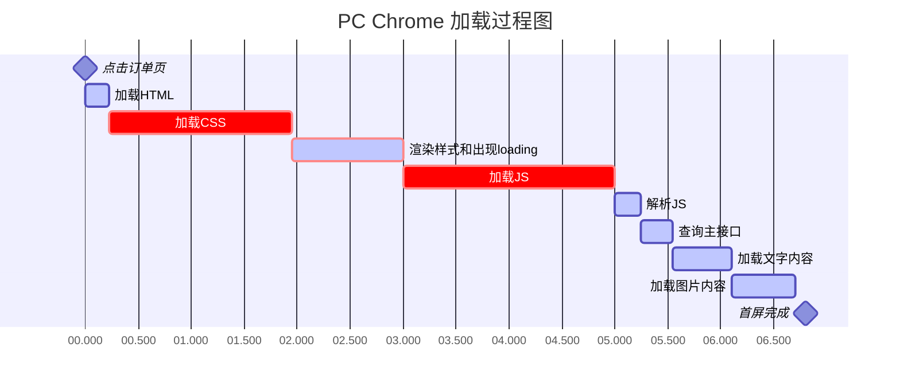
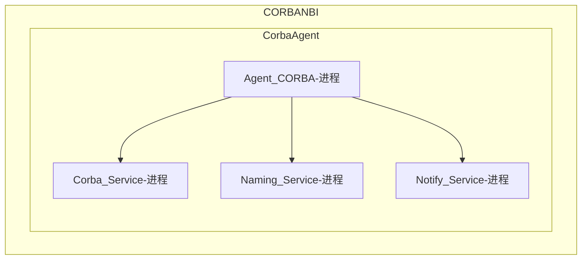

 # Flow chart
 ```mermaid
	 graph TD
      A[Start] --> B;
      B -- Yes --> C[OK];
      C --> D[Rethink];
      D --> B;
      B -- No --> E[End]; 
``` 
# Sequence chart 
 ```mermaid
	 sequenceDiagram
      Alice->>John: Hello John, how are you?
      John-->>Alice: Great! 
``` 
# Gantt chart 
 ```mermaid
	 gantt
      dateFormat  DD/MM/YY
      Task 1 :active, 09/04/18, 30/10/20
      Milestone 1 :milestone, 29/09/20, 1d
      Task 2 :active, 11/11/19, 19/10/20
      Milestone 2 :milestone, 30/09/20, 1d
      Task 3 :active, 18/02/19, 10/07/20
      Milestone 3 :milestone, 01/10/20, 1d
      Task 4 :active, 11/03/19, 04/08/20
      Milestone 4 :milestone, 11/10/19, 1d 
```




